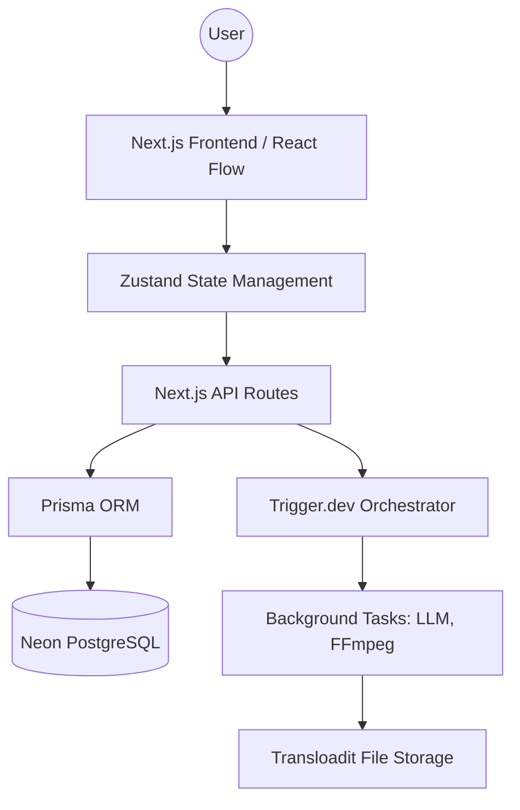

# NextFlow: Project Deep Dive & Technical Architecture

Welcome to the **NextFlow** technical deep dive. This document explains the architecture, design decisions, and core components of the application to help you understand "the why" behind the code.

## 1. High-Level Architecture

NextFlow is built as a modern, full-stack Next.js application. It follows a decoupled architecture where the UI (Frontend), Workflows (Orchestration), and Node Execution (Backend Tasks) are separate concerns.

## 2. Core Components & Folder Structure

- **`/src/components/canvas`**: Contains the React Flow integration. This is the heart of the app where nodes and edges are rendered.
- **`/src/components/nodes`**: Custom React Flow nodes. Each node type (Text, Image, LLM, etc.) has its own file and logic.
- **`/src/trigger`**: Trigger.dev task definitions. This is where the heavy lifting happens (calling Gemini, running FFmpeg).
- **`/src/lib/store.ts`**: The central state for the canvas, managing nodes, edges, and real-time execution status.
- **`/src/lib/workflow-engine.ts`**: The mathematical core that handles DAG traversal, dependency resolution, and parallel execution logic.

## 3. Key Concepts

### Reactive Node UI
Unlike static nodes, NextFlow nodes are reactive. When a task is running in the background via Trigger.dev, the node receives status updates via Webhooks or Polling (depending on the implementation) and displays a **pulsating glow**.

### DAG (Directed Acyclic Graph)
A workflow is a graph where data flows from left to right. We must ensure no circular connections (loops) exist, as they would cause infinite execution. We use a topological sort algorithm to determine the order of node execution.

### Trigger.dev for Execution
We do NOT run LLM or FFmpeg tasks directly in Next.js API routes. Why?
1. **Timeouts**: LLM calls and video processing can take minutes. Standard API routes time out after 10-30 seconds.
2. **Reliability**: Trigger.dev provides built-in retries and state management.
3. **Observability**: We can track the progress of every task in the Trigger.dev dashboard.

### Transloadit for Media
Transloadit handles the complexity of file uploads and media delivery. It provides optimized URLs for images and videos that we use as inputs for our nodes.

## 4. Development Strategy

We will build in "Phases". Each phase ends with a working piece of the puzzle:
1. **Foundation**: The shell of the app.
2. **System**: The logic of the canvas.
3. **Inputs/Outputs**: Getting data in and out.
4. **Execution**: Making the nodes "alive".
5. **Intelligence**: Integrating Gemini.
6. **Persistence**: Saving and history.

Understanding this structure will help you contribute to the developer-side of the project effectively.
